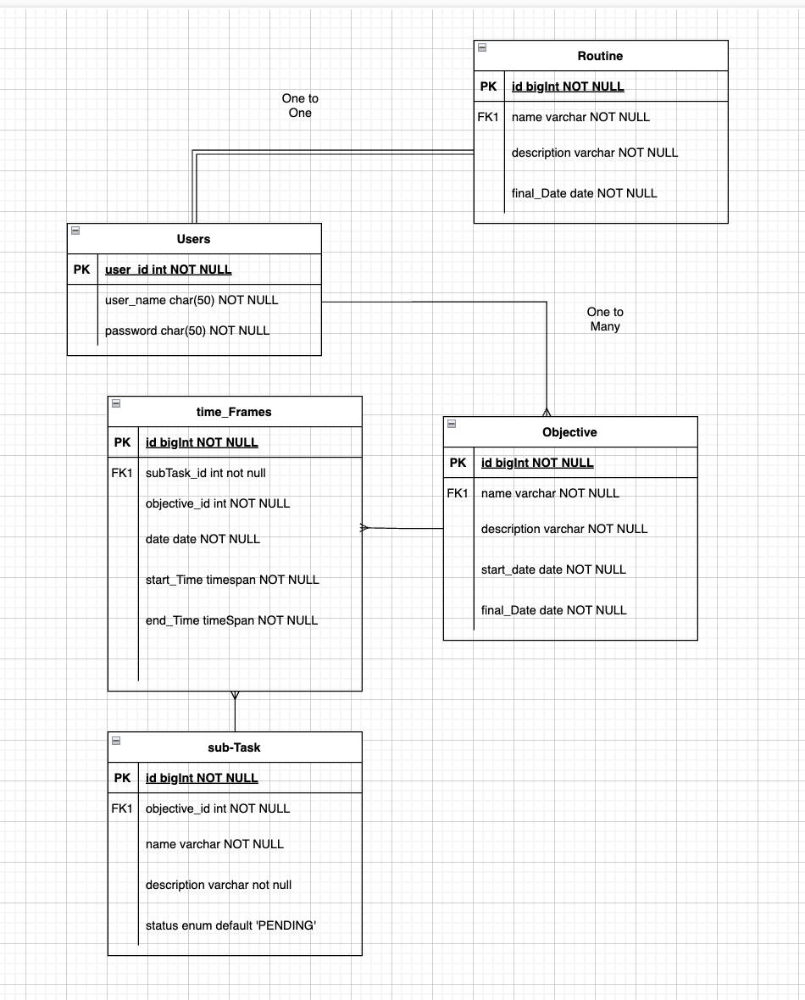

# Goal Management System

The Goal Management System is a web application designed to help users define, organize, and track their goals by breaking them into actionable tasks. Users can allocate specific time slots to each task, and the app features an interactive calendar view to display past and upcoming tasks with their respective time commitments. This system enables users to monitor progress, optimize their schedules, and stay organized, offering an intuitive interface for goal prioritization and time management.

## Features:
### Set a base routine
- Work time, Lunch, etc. 

### Set an Objecive
- Set subtasks for the objective (give visual feedback on completion)
- Display a motivation quote pulled from an API at user defined intervals
- Notify when you should start doing subtask

## Tech Stack
### Front-end
- React
- TanStack Router/Query
- Mui
- Shadcn
- Tailwind CSS

### Back-end
- Spring Boot
- JWT 
- PostgreSQL

## ERD model

## API integrations

Few api that we will be using in our application are:
 - ImprovMX - email notification upon task completion, or upcoming task
 - Zenquotes.io - supply randomized quotes

## Deployment
- AWS
- Jenkins
